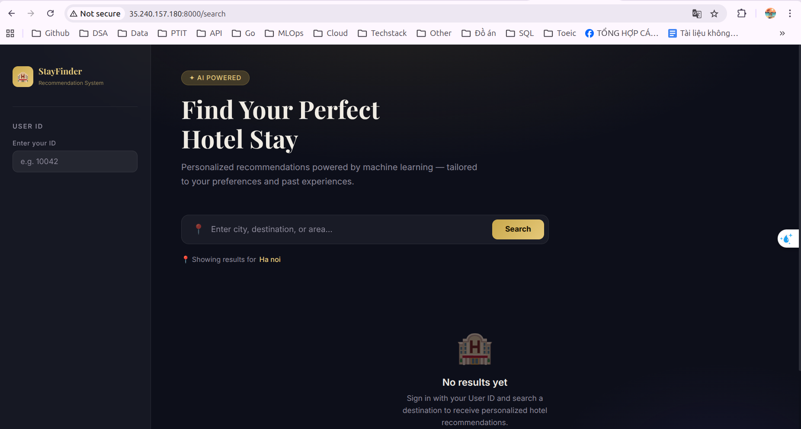
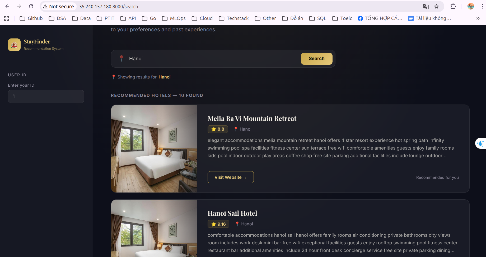

# Hotel Data Lakehouse Platform

## Project Overview

This project implements a **scalable hotel recommendation data platform** that supports both **On-Premise** and **Cloud deployments**.

The system collects hotel data from **Booking.com**, processes large-scale datasets using distributed data processing frameworks, and serves personalized hotel recommendations through a web application.

The platform demonstrates how modern **data engineering pipelines** can be built using:

- Data Lakes
- Distributed processing engines
- Data warehouses
- Workflow orchestration
- Infrastructure as Code

Two deployment architectures are provided:

1. **On-Premise Deployment** – built with open-source infrastructure
2. **Cloud Deployment (Google Cloud Platform)** – built with managed cloud services

---

# System Architectures

## On-Premise Architecture


The on-premise architecture uses open-source technologies to build a full data platform.

Key components include:

- **MinIO** – Data Lake storage
- **Hive Metastore** – Metadata catalog
- **Trino** – Distributed SQL query engine
- **Apache Spark** – Data transformation
- **PostgreSQL** – Data warehouse
- **Docker & Docker Compose** – Container orchestration

Raw datasets are stored in MinIO, processed by Spark, and loaded into PostgreSQL for analytics and recommendations.

Full documentation:

```
on-premise/README.md
```

---

## Cloud Architecture (Google Cloud Platform)


The cloud deployment replaces local infrastructure with managed cloud services.

Key components include:

- **Google Cloud Storage (GCS)** – Data Lake storage layer
- **Dataproc** – Distributed PySpark processing
- **BigQuery** – Serverless data warehouse
- **Apache Airflow** – Workflow orchestration
- **Google Compute Engine (GCE)** – Application hosting
- **Terraform & Ansible** – Infrastructure provisioning

Airflow orchestrates the data pipeline by creating Dataproc clusters, submitting PySpark transformation jobs, and loading curated data into BigQuery.

Full documentation:

```
cloud/README.md
```

---

# Data Pipeline Overview

The data platform processes hotel datasets through the following stages:

1. Crawl hotel data and user reviews from **Booking.com**
2. Export raw datasets to the **Data Lake**
3. Transform datasets using **Apache Spark / PySpark**
4. Load curated data into the **Data Warehouse**
5. Query analytical datasets
6. Serve personalized recommendations via the web application

---

# Recommendation Models

The system implements multiple recommendation algorithms:

### Collaborative Filtering – User Based

Recommends hotels based on **similar users**.

### Collaborative Filtering – Item Based

Recommends hotels based on **similar hotels**.

### Content-Based Filtering

Recommends hotels using **text similarity from hotel descriptions (TF-IDF)**.

These models are trained offline and used by the recommendation API.

---

# Web Application

The platform includes a web application that allows users to retrieve hotel recommendations.

Users can:

- input **user ID**
- input **location**
- retrieve **personalized hotel recommendations**

Example interface:





---

# Technologies

## Data Processing
- Python
- Apache Spark
- PySpark

## Data Platform
- MinIO
- Google Cloud Storage
- Dataproc
- BigQuery

## Query & Analytics
- Trino
- PostgreSQL

## Workflow Orchestration
- Apache Airflow

## Infrastructure
- Docker
- Docker Compose
- Terraform
- Ansible

---

# Deployment Guides

Detailed setup instructions are available in the following directories:

### On-Premise Deployment

```
on-premise/README.md
```

### Cloud Deployment (GCP)

```
cloud/README.md
```

---

# Project Goals

This project demonstrates how to build an **end-to-end data platform** for recommendation systems, including:

- Data ingestion
- Data lake storage
- Distributed data processing
- Data warehouse modeling
- Pipeline orchestration
- Infrastructure automation
- Recommendation serving

The platform showcases both **open-source data stack deployments** and **cloud-native architectures**.