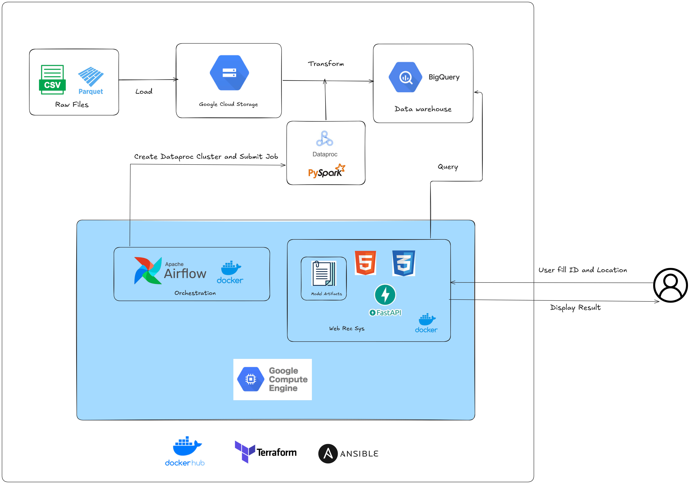
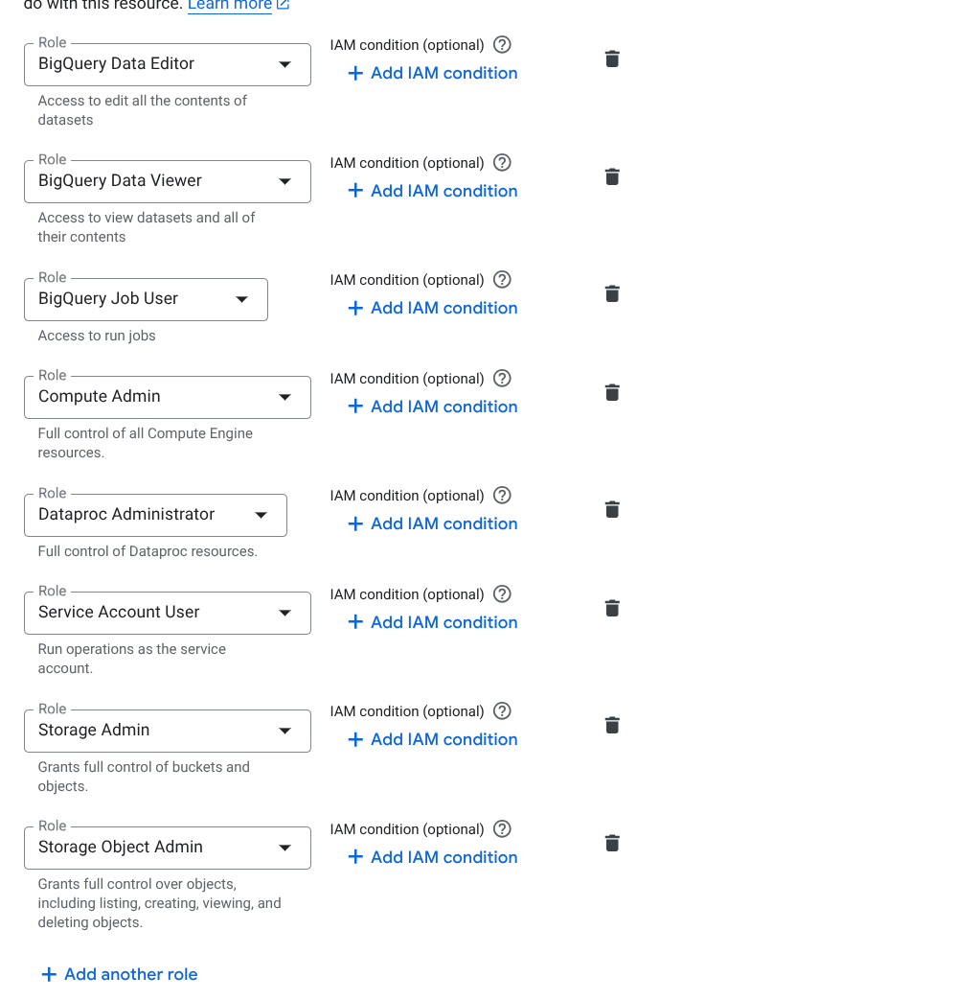
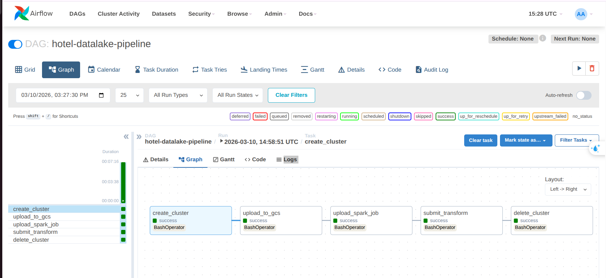
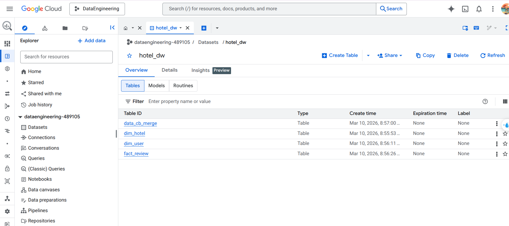
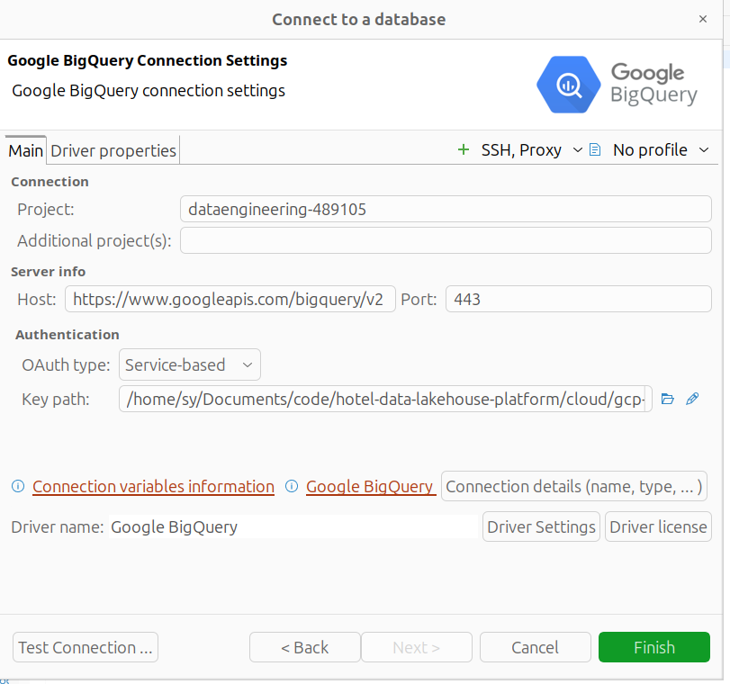
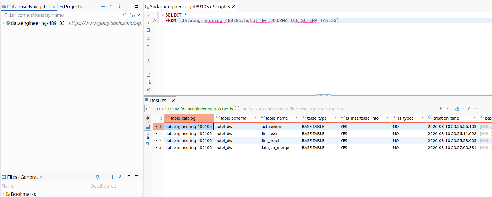
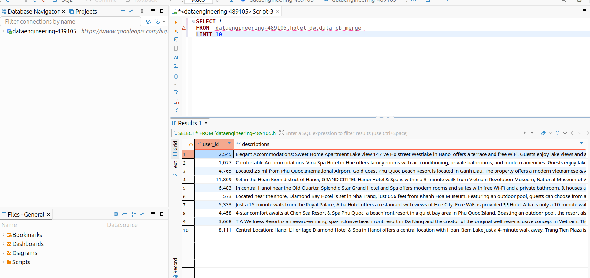

# Hotel Recommendation System (Cloud Deployment - GCP)

## System Overview

This project provides a **cloud deployment architecture on Google Cloud Platform (GCP)** for the hotel recommendation system.

The system processes hotel datasets, performs large-scale transformations using PySpark, stores analytical data in BigQuery, and serves recommendations through a containerized API.

Compared to the on-premise deployment, this cloud architecture replaces local infrastructure components with managed GCP services.

### Key Changes Compared to On-Premise Deployment

- **MinIO → Google Cloud Storage (GCS)**
- **Hive / Trino removed**
- **PostgreSQL Data Warehouse → BigQuery**
- **Local Spark jobs → Dataproc PySpark jobs**
- **Airflow orchestrates Dataproc clusters and jobs**
- Infrastructure provisioned using **Terraform and Ansible**

---

# System Architecture



The system uses a cloud-native architecture where:

- **Google Cloud Storage** acts as the Data Lake
- **Dataproc** performs large-scale data transformation using PySpark
- **BigQuery** stores analytical datasets
- **Airflow** orchestrates the pipeline
- **Docker containers** host the recommendation API and Airflow
  
---

# Cloud Data Pipeline

The cloud data pipeline consists of the following stages:

1. Upload raw datasets (CSV / Parquet) to **Google Cloud Storage**
2. Airflow creates a **Dataproc cluster**
3. Airflow uploads the **PySpark transformation job**
4. Airflow submits the job to a **Dataproc cluster**
5. Dataproc processes raw datasets from **GCS**
5. Processed datasets are loaded into **BigQuery**
6. The recommendation API queries BigQuery
7. Results are returned to the web application

---

# Infrastructure Provisioning

Cloud infrastructure is provisioned using **Terraform and Ansible**.

## Terraform

Terraform is used to create the **Google Cloud Storage bucket** that acts as the Data Lake.

Run:

```bash
cd terraform
terraform init
terraform apply
```

Example bucket created:

```
gs://hotel-data-lake
```

This bucket stores raw datasets used in the pipeline.

Example structure:

```
gs://hotel-data-lake
│
├── raw
│   ├── data_merge
│   ├── data_cb_merge
│   ├── hotel_ratings
│   └── hotel_details
```

---

# Compute Infrastructure (GCE)

A **GCE VM instance** is used to run the following services:

- Apache Airflow (pipeline orchestration)
- Hotel Recommendation API

Both services are deployed using **Docker containers**.

---

# Infrastructure Deployment with Ansible

Ansible is used to automate:

- VM instance creation
- Firewall rule configuration
- Docker installation
- Application deployment

First, create a **Service Account** and generate a **JSON key** with the required permissions.



---

## Create VM Instance

Run:

```bash
cd ansible
ansible-playbook create_compute_instance.yaml
```

This playbook creates:

- a **GCE VM instance**
- required **firewall rules**

---

## Deploy Airflow and Application

After the instance is created, obtain the **external IP address** and SSH into the VM:

```bash
ssh {user}@{external_IP}
```

After that, deploy the services:

```bash
ansible-playbook -i inventory deploy.yaml
```

This will:

- install prerequisites
- install Docker
- copy files to VM
- pull Docker images
- start Airflow services
- start the recommendation application

---

# Airflow Deployment

Airflow is deployed using:

```
airflow-docker-compose.yaml
```

Airflow is deployed using Docker Compose and runs the following containers:

- airflow-webserver
- airflow-scheduler
- airflow-worker
- airflow-trigger

These components manage the orchestration of the data pipeline.

Responsibilities of Airflow:

- Create **Dataproc cluster**
- Upload datasets to **GCS**
- Upload the **PySpark transformation script**
- Submit transformation jobs to Dataproc
- Delete the Dataproc cluster after completion
- Monitor pipeline execution



---

# Google Cloud Storage

Raw datasets are stored in **Google Cloud Storage (GCS)**.

Example directory structure:

```
gs://hotel-data-lake
│
├── raw
│   ├── data_merge
│   ├── data_cb_merge
│   ├── hotel_ratings
│   └── hotel_details
```

Datasets are stored in **Parquet format** for efficient processing with Spark.

---

# Data Transformation with Dataproc

Large-scale data processing is performed using **PySpark on Dataproc**.

Airflow performs the following tasks:

1. Create a **Dataproc cluster**
2. Upload a **PySpark job**
3. Submit a **PySpark job**

The PySpark job performs the following operations:

1. Read raw data from **GCS**
2. Clean and transform the datasets
3. Load the processed data into **BigQuery**

NOTE: Before triggering the Airflow DAG, create a BigQuery dataset named: `hotel_dw`

---

# Data Warehouse (BigQuery)

After transformation, datasets are stored in **BigQuery** for analytics and querying.

Example warehouse structure:

```
hotel_data_warehouse
│
├── fact_user_ratings
├── dim_hotels
└── hotel_features
```




---

# BigQuery Capabilities

BigQuery provides:

- scalable analytical storage
- high performance SQL queries
- serverless data warehouse capabilities

---

# Recommendation Application

The recommendation API is packaged as a **Docker image**.

The image is pushed to **DockerHub** and later pulled by the GCE instance during deployment.

## Build Docker Image

```bash
docker build -t hotel-recommender .
```

## Push to DockerHub

```bash
docker tag hotel-recommender <dockerhub-username>/hotel-recommender:latest
docker push <dockerhub-username>/hotel-recommender:latest
```

---

# Application Deployment

The **Google Compute Engine instance** runs two main services:

### Apache Airflow

Responsible for pipeline orchestration.

### Recommendation API

Provides API endpoints to retrieve recommended hotels

---

# Access the Application

After deployment is complete, the application can be accessed using the external IP of the GCE instance.

```
http://<GCE_EXTERNAL_IP>:8000
```

Users can:

- input **user ID**
- input **location**
retrieve personalized hotel recommendations

---

# Query by DBeaver







---


# Technologies

## Data Processing
- Python
- PySpark
- Dataproc

## Cloud Platform
- Google Cloud Platform
- Google Compute Engine
- Google Cloud Storage
- BigQuery

## Orchestration
- Apache Airflow

## Infrastructure as Code
- Terraform
- Ansible

## Containerization
- Docker
- DockerHub