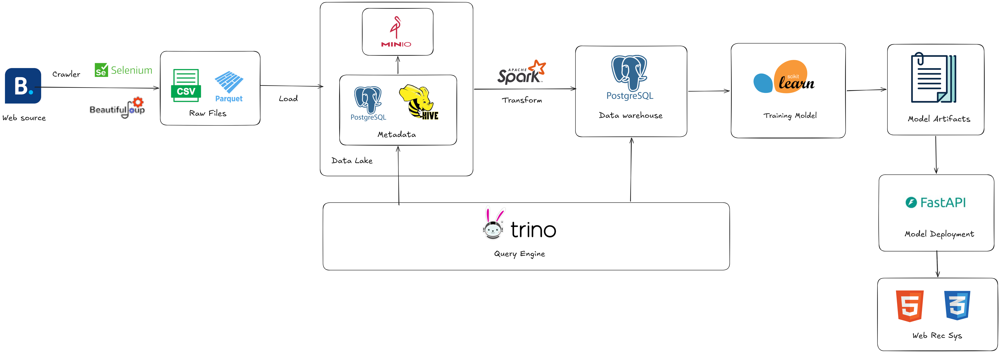
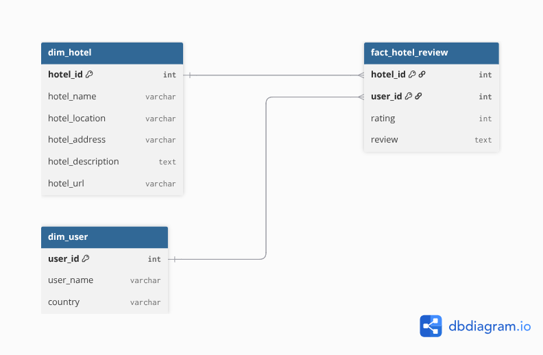
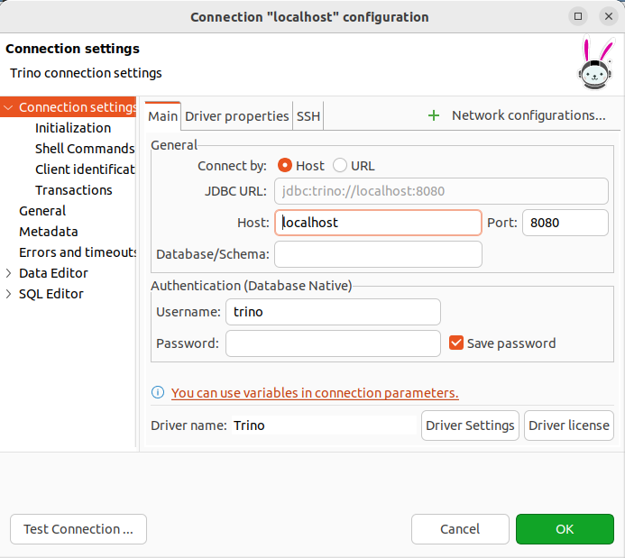

# Hotel Recommendation System (On-Premise Deployment)

## System Overview

This project implements an **on-premise hotel recommendation system** that crawls hotel data from **Booking.com**, trains multiple recommendation models, and deploys them in a containerized infrastructure.

The system includes the following components:

- Data crawler for collecting hotel data from Booking.com
- Recommendation models (Collaborative Filtering & Content-Based)
- Containerized infrastructure using Docker
- Data Lake using MinIO
- Query engine using Trino
- Data Warehouse using PostgreSQL
- Data transformation using Apache Spark

---

# System Architecture



## Data Pipeline

The system pipeline consists of the following stages:

1. Crawl hotel data and user reviews from Booking.com
2. Train recommendation models (CF User, CF Item, Content-Based)
3. Package the application into a Docker image
4. Deploy the infrastructure using Docker Compose
5. Export raw data to the Data Lake (MinIO)
6. Query raw data using Trino
7. Transform data using Apache Spark
8. Load curated data into PostgreSQL Data Warehouse
9. Serve recommendations through the API
    
---
# 1. Data Collection & Model Training

All training scripts are located in:

```
rec-sys-training/
```

This module performs two main tasks:

- Crawl hotel data from Booking.com
- Train recommendation models

---

# 1.1 Crawl Data from Booking.com

The crawler collects the following information:

- Hotel URL
- Hotel location
- Hotel name
- Hotel description
- Hotel address
- Hotel ratings
- User rating
- User review
- User country

These datasets are later used to train recommendation models.

---

# 1.2 Recommendation Models

The system implements **three recommendation approaches**.

## Collaborative Filtering - User Based

Recommends hotels based on **similar users**.

Idea:

Users with similar rating behavior are likely to prefer similar hotels.

Steps:

1. Build a **User - Item interaction matrix**
2. Compute similarity between users
3. Recommend hotels liked by similar users

Rating Scale: **0 – 10**

| Metric | Value |
|------|------|
| MAE | 1.187 |
| RMSE | 1.668 |
| NMAE | 0.118 |

---

## Collaborative Filtering - Item Based

Recommends hotels based on **similar hotels**.

Idea:

Hotels with similar rating patterns are recommended together.

Steps:

1. Compute **item similarity**
2. Recommend hotels similar to those a user liked

Rating Scale: **0 – 10**

| Metric | Value |
|------|------|
| MAE | 1.364 |
| RMSE | 1.989 |
| NMAE | 0.136 |


---

## Content Based Filtering

Recommends hotels based on **descriptions**.

Features used hotel description and text processing techniques: TF-IDF

Top-10 recommendation accuracy: **23.98%**
---

# 1.3 Train Models

Training scripts generate model artifacts such as:

```
models/
│
├── desc_matrix.pkl
├── hotels.pkl
└── vectorizer.pkl
```

These models are used later by the recommendation API.

---

# 2. Build Docker Image

After training is complete, build the Docker image for the application.

## Build image

```bash
docker build -t hotel-recommender .
```

## Push to DockerHub

```bash
docker tag hotel-recommender <dockerhub-username>/hotel-recommender:latest

docker push <dockerhub-username>/hotel-recommender:latest
```

---

# 3. Infrastructure Initialization

The system infrastructure is started using **Docker Compose**.

Services included:

- MinIO (Data Lake)
- Hive Metastore
- PostgreSQL (Metadata)
- Trino (Query Engine)
- PostgreSQL (Data Warehouse)
- Apache Spark
- Recommendation API

## Start infrastructure

```bash
docker compose -f docker-compose.yml up -d
```

---

# 4. Export Data to Data Lake (MinIO)

After the infrastructure is running, export the raw datasets into **MinIO Data Lake**.

Run:

```bash
python utils/export_data_to_datalake.py
```

This script uploads datasets to MinIO in **Parquet format**.

Example structure:

```
hotel-data-lake
│
├── raw
│   ├── data_merge
│   ├── data_cb_merge
│   ├── hotel_ratings
│   └── hotel_details
```

---

# 5. Create Schema & Tables in Trino

You can create tables either by:

- executing SQL inside the **Trino container**
- or connecting to **Trino using DBeaver**

---

## Create Schema

```sql
create schema if not exists hive.hotel_data_lake
with (location='s3://hotel-data-lake/')
```

---

## Create Tables

### data_cb_merge

```sql
create table if not exists hive.hotel_data_lake.data_cb_merge (
    user_id integer,
    location varchar,
    name_hotel varchar,
    descriptions varchar
) with (
    external_location = 's3://hotel-data-lake/raw/data_cb_merge',
    format = 'PARQUET'
);
```

---

### data_merge

```sql
create table if not exists hive.hotel_data_lake.data_merge (
    hotel_id integer,
    user_id integer,
    user varchar,
    country varchar,
    review varchar,
    rating double,
    hotel_url varchar,
    hotel_location varchar,
    hotel_name varchar,
    hotel_description varchar,
    hotel_address varchar,
    hotel_avg_rating double
) with (
    external_location = 's3://hotel-data-lake/raw/data_merge',
    format = 'PARQUET'
);
```

---

### hotel_ratings

```sql
create table if not exists hive.hotel_data_lake.hotel_ratings (
    hotel_id integer,
    user_id integer,
    user varchar,
    country varchar,
    review varchar,
    rating varchar
) with (
    external_location = 's3://hotel-data-lake/raw/hotel_ratings',
    format = 'PARQUET'
);
```

---

### hotel_details

```sql
create table if not exists hive.hotel_data_lake.hotel_details (
    hotel_url varchar,
    hotel_location varchar,
    hotel_id integer,
    hotel_name varchar,
    hotel_description varchar,
    hotel_address varchar,
    hotel_avg_rating varchar
) with (
    external_location = 's3://hotel-data-lake/raw/hotel_details',
    format = 'PARQUET'
);
```

---

# 6. Transform Data Lake → Data Warehouse (Spark)

After data is available in the **Data Lake**, we transform it into structured tables in the **PostgreSQL Data Warehouse**.

The transformation is implemented using **Apache Spark**.

Script location:

```
spark/scripts/transform_lake_to_warehouse.py
```

This script performs:

1. Read Parquet data from **MinIO Data Lake**
2. Transform and clean the datasets
3. Load the processed data into **PostgreSQL**

The Spark job loads processed datasets into PostgreSQL tables such as:



---
  
## Run Spark Job

Execute the Spark transformation job:

```bash
python spark/scripts/transform_lake_to_warehouse.py
```

---

# 7. Query with DBeaver

## 1. Install DBeaver

Download:

https://dbeaver.io/download/

---

## 2. Connect to Trino

Create a new **Trino connection** with the following information:

```
Host: localhost
Port: 8080
Database: hive
User: trino
Password: (empty)
```

Example:



---

## 3. Run Queries

Example query:

```sql
SELECT *
FROM hive.hotel_data_lake.data_merge
LIMIT 10;
```

---

# 8. Access Recommendation Application

After all services are running, access the application at:

```
http://localhost:8000
```

The web interface allows users to:

- search hotels
- get recommendations
  
---


# Technologies

## Data Processing
- Python
- Apache Spark

## Infrastructure
- Docker
- Docker Compose

## Data Platform
- MinIO (Data Lake)
- Hive Metastore
- Trino
- PostgreSQL

## Data Query
- DBeaver